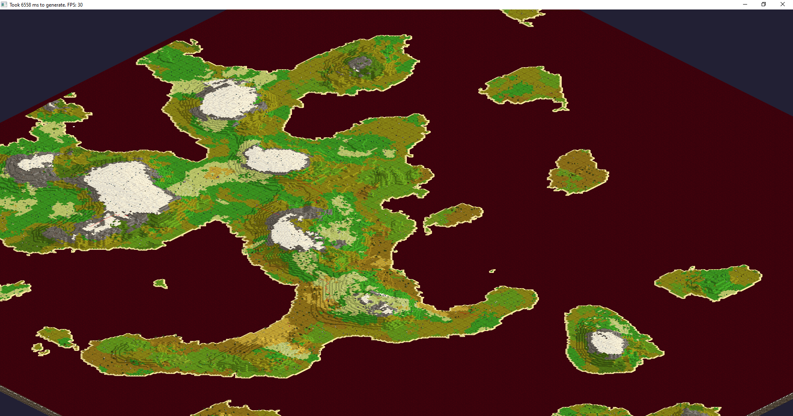
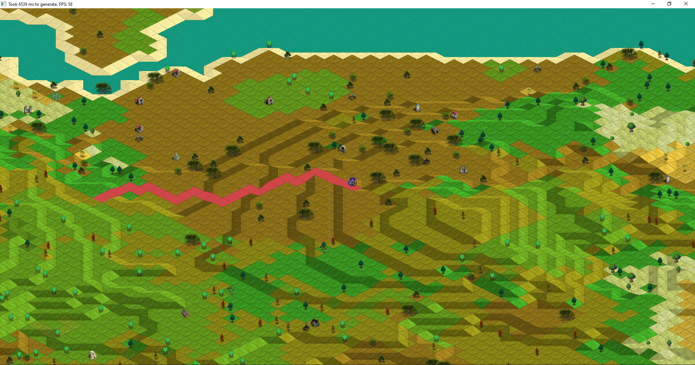

# LibGdx training
### Motivation
This project was created for purposes to learn LibGdx. As I have two infants Im currently struggling with spare time which can be seen on the quality of code. 
Most of this was done in a way just to have it working asap. Hopefully in future I will find some time for refactoring.

Important note: Currently I am trying to refactor code at least a little bit so that I can commit it. 
Meaning that most of the classes is still missing and I will be adding them to project from time to time when I feel comfortable to make it public and dont be ashamed :)

### Contents
What there currently is:

Map (world) generator with following features:
- Based on perlin noise or Diamond square algorithm. World is composed of different layers, each representing some worlds "feature" like humidity, height, hostility, temperature etc. You can check sample screenshots to see how it looks  
- Generate world up to 2048x2048 tiles. Bigger world is also possible but it is not recommended as may take a lot of time and possibly fail on low memory. 
I am planning to fix this as bigger is just better :) and it should be possible to create 4096 x 4096 map without problems but it does not have priority now.  
Largest map tried was 4096x4096 but is rendered with just 1fps on middle-tier desktop. Also generation currently takes more then minute. 
- World is generated with a few trees. Trees are supposed to grow and expand on other tiles in time (or die). There is already an in-game algorithm. With some flaws yet. 
- World can contain canyons. Im still not sure if it looks nice nor if it has any meaningful purpose but it is there :)
- Factions are generated with their territories. You can check territory map bellow. Each faction has some randomly generated race type with stats like min/max age, height, weight and features like grey skin, blue eyes, horns etc, third eye etc. Currently this is just a cosmetic thing :)
- There is simple character generator which can be used to generate PC's/NPC's with name, race type and some basic features, stats and characteristics. Id like to add to characters biography based on the world  
- Towns together with paths (roads) between some of them. Towns are without purpose so far
- Biome regions are defined together with names. Regions are just groups of adjacent tiles with same biome type   
- Places of interest are generated. So far you can only enter dungeon which is generated with usage of squidlib
- Traveling between worlds should be possible via gates

Time:
- game contains world clock. Every generated world has different length of day and different number of days in year. This is reflected in day/night cycle which is already implemented
- Scheduler takes care of changes over time. Currently there are scheduled tasks to grow/die trees and grow factions territory.
- PC's/ NPC's should grow older. Each character has age and biological age. Age is related only to time but biological age can be modified by some uncommon circumstances. 
For example living in a world with high gravity increases biological age and thus shortens life span. Or casting some difficult spell might also make character older etc...   

Pathfinding:
- uses DijkstraMap (from SquidLib library) to find path to cursor from player. Im planning to use it to implement some basic AI where player can have multiple goals and it can decide based on its priorities and distance which goal will it follow.  
- Some buggy movement is also implemented both for Player and random movement for AIs

Other:
- There is an in-game hud which is currently used mainly for debugging. We can check properties like height, temperature, hostility and so on for each tile. Important feature is also worldgen window which allows us to specify what algorithm is used for generation of world and we can customize some of its parameters like 
octaves, scale, frequency of perlin noise etc... 
- LibGdx particle system, simple character animations

### Screenshots
All screenshots are zoomed out largely. For close view check last screenshot
Islands

Classic

Diamond square algorithm

Detail

### Sample layers of world 1024 * 1024
------------ | ------------- | 
------------ | ------------- |
Biome  | Heat: 
Moisture:  | Water: 
Territory:  | Normal: 
Color heightmap:  | Hostility: 

### Roadmap
- dungeon generation using squidlib. Start with some simple dungeon, then create multiple various options. Dungeon can be entered from world map
- add battlefield map. There should be list with entities sorted by initiative order, panel with PC's, panel with NPC's
- add random materials to each world.
- add gate PoI allowing travelling to other worlds   
- add worldopedia containing (not sure about the name yet :) ) with information about all generated world stuff:
    - for example day length, number of days in year, dawn time, night time
    - type of world, whether it is highly populated, has islands or continents, its hostility, temperature, moisture, height
    - factions of the world. Each faction has population of at least one race type. Faction has color, populations by raceType, cities, savageness, alignment, birthrate, culturalInfluence? 
    - worlds currency/currencies
    - available materials on the given world. There should be like 300 available materials on the whole universe. World should contain about 20-100 of that based on its size.
    - available plants. Uses SquidLib Thesaurus to generate plant names. Plants are used as components for spells, potions, maybe magical items?
    - available spells. Generated randomly based on factions race types (and its flags like 'ice affinity', 'fire affinity', 'nature affinity', 'violent', 'peaceful'...) and put together. Ingredients   
    - available items - various swords, axes, polearms which is not much important  
    - available magical items. Or to be more precise - item enchantments. For example 
    - tree types differ per biome. Each biome has one tree type of 3 different sizes (+1 for dead tree)
    - available monsters (monster types, these sould be also randomly generated). Available species: humanoid, mutant (diffent count of legs, arms, heads, eyes...), animal, undead, demon, blob, draconic (dragonlike)...
    - notable regions (just biome regions)    
- add possibility to enter cities
    - There should be some shops for sure, guilds possibly, priest (ressurect/heal), library to research new spells, blacksmith
    - on some main screen
- add PC interactions - Their sanity, health, fatigue, mana is restored after rest
- add new events to scheduler
    - cities increase population with time. There are various city sizes. City buildings vary based on size
    - factions expand their territory
    - factions have 
    - all NPC's and PC's grow older (once a day is enough)
    - towns renew shop items

### Todos for current features or known bugs
- trees placement inside tile should be random (current there can be patterns seen on world map as position is calculated from tiles x and y position) 
- allow more trees on one tile 

### Credits
Currently some of the functionality is used from other projects. A large thank you is dedicated mainly to two projects. Cartezza mapgen and  

Cartezza map generator - textures creation for maps was mainly used from mapgen project created by zachary carter. Link will be in comments 

SquidLib - library created to simplify creation of roguelike games. Contains for example world map generators, dungeon generators, some classes simplyfying ui and dungeon display and many utility classes usefull for creation of roguelike games. 

Icons - mostly from hive workshop. Credits to each one of the icons (or group of icons) will be in assets folder in text file credits.txt

VisUi - just libgdx skin with some new useful UI components. Great to have 

VNameGenerator = by Valkryst. Library for generation of words based on some input file. Based on markov chains but I think there are more options

