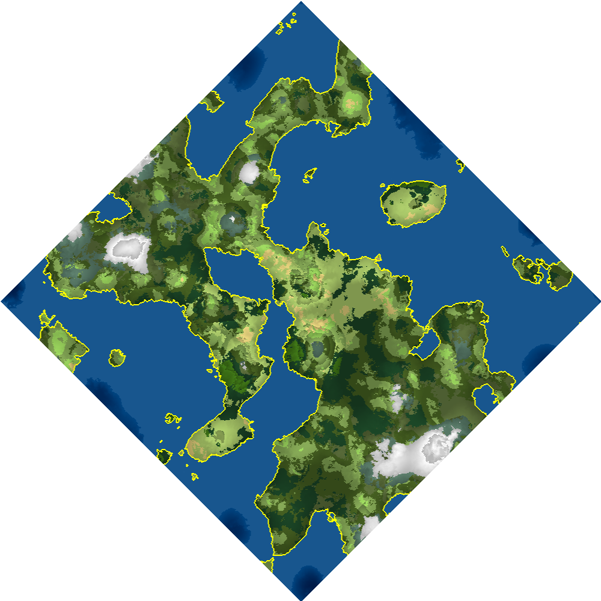
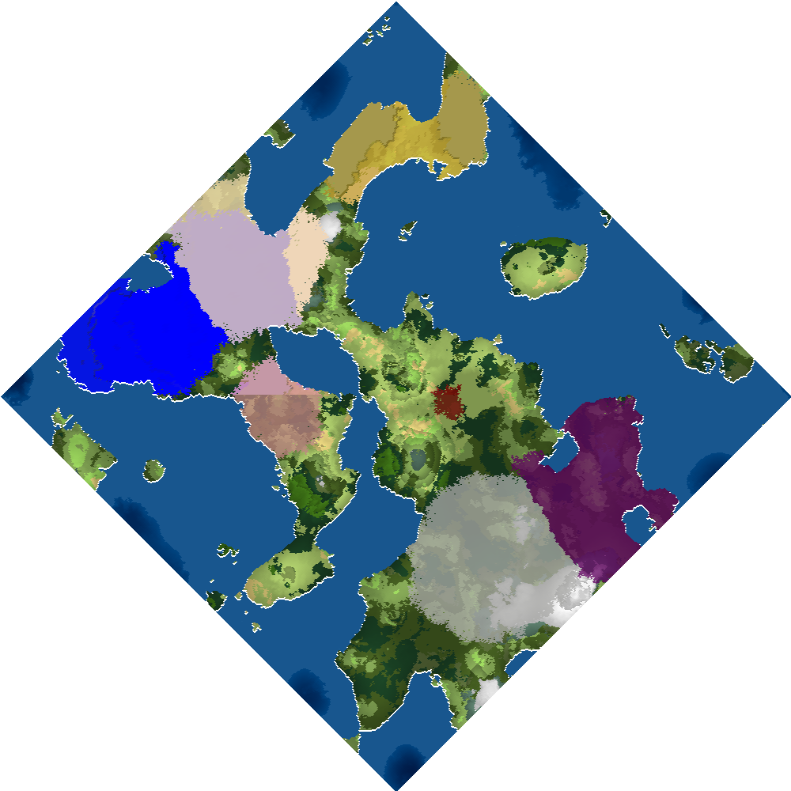

#LibGdx training
###Motivation
This project was created for purposes to learn LibGdx. As I have two infants Im currently struggling with spare time which can be seen on the quality of code. 
Most of this was done in a way just to have it working asap. Hopefully in future I will find some time for refactoring  

###Credits
Currently, some of the functionality is used from other projects. A large thank you is dedicated mainly to two projects: 
Cartezza map generator - textures creation for maps was mainly used from mapgen project created by ... 
SquidLib - library created to simplify creation of roguelike games. Contains for example world map generators, dungeon generators, some classes simplyfying ui and dungeon display and many utility classes usefull for creation of roguelike games 
Icons - mostly from hive workshop. Credits to each one of the icons (or group of icons) will be in assets folder in text file credits.txt

###Contents
What there currently is:
Map (world) generator with following features:
- Generate world up to 2048x2048 tiles. Bigger world is also possible but it is not recommended as may take a lot of time and possibly fail on low memory. 
Largest map tried was 4096x4096 but is rendered with just 1fps on middle-tier desktop. 
- World is generated with a few trees. Trees are supposed to grow and expand on other tiles in time (there is already an in-game algorithm)
- World can contain canyons. Im still not sure if it looks nice nor if it has any meaningful purpose
- Factions are created. Faction has some race type
- Biome regions are defined together with names. Regions are just groups of adjacent tiles with same biome type   
- Places of interest are generated. So far you can only enter dungeon

  

###Roadmap
- dungeon generation using squidlib. Start with some simple dungeon, then create multiple various options. Dungeon can be entered from world map
- add battlefield map. There should be list with entities sorted by initiative order, panel with PC's, panel with NPC's
- add random materials to each world.
- add gate PoI allowing travelling to other worlds   
- add worldopedia containing (not sure about the name yet :) ) with information about all generated world stuff:
    - for example day length, number of days in year, dawn time, night time
    - type of world, whether it is highly populated, has islands or continents, its hostility, temperature, moisture, height
    - factions of the world. Each faction has population of at least one race type. Faction has color, populations by raceType, cities, savageness, alignment, birthrate, culturalInfluence? 
    - worlds currency/currencies
    - available materials on the given world. There should be like 300 available materials on the whole universe. World should contain about 20-100 of that based on its size.
    - available plants. Uses SquidLib Thesaurus to generate plant names. Plants are used as components for spells, potions, maybe magical items?
    - available spells. Generated randomly based on factions race types (and its flags like 'ice affinity', 'fire affinity', 'nature affinity', 'violent', 'peaceful'...) and put together. Ingredients   
    - available items - various swords, axes, polearms which is not much important  
    - available magical items. Or to be more precise - item enchantments. For example 
    - tree types differ per biome. Each biome has one tree type of 3 different sizes (+1 for dead tree)
    - available monsters (monster types, these sould be also randomly generated). Available species: humanoid, mutant (diffent count of legs, arms, heads, eyes...), animal, undead, demon, blob, draconic (dragonlike)...
    - notable regions (just biome regions)    
- add possibility to enter cities
    - There should be some shops for sure, guilds possibly, priest (ressurect/heal), library to research new spells, blacksmith
    - on some main screen
- add PC interactions - Their sanity, health, fatigue, mana is restored after rest
- add new events to scheduler
    - cities increase population with time. There are various city sizes. City buildings vary based on size
    - factions expand their territory
    - factions have 
    - all NPC's and PC's grow older (once a day is enough)
    - towns renew shop items

###Sample maps
------------ | ------------- | 
------------ | ------------- |
Biome  | Heat: 
Moisture:  | Water: 
Territory:  | Normal: 
Color heightmap:  | Hostility: 
Height: | | Inverted noise: |

###Todos for current features or known bugs
- trees placement inside tile should be random (current there can be patterns seen on world map as position is calculated from tiles x and y position) 
- allow more trees on one tile 